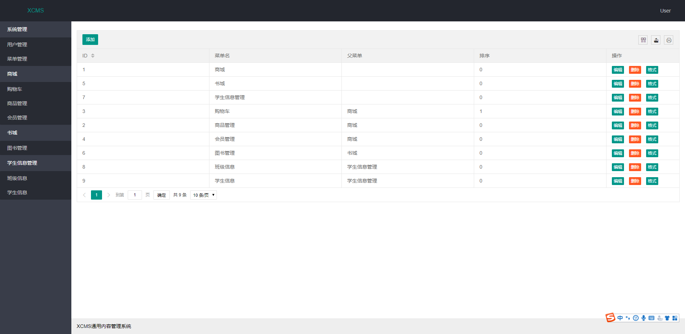

# beegopom
该项目基于慕课网Go开发企业级内容管理平台课程，由于作者没有分享源码，现把个人学习的代码开源出来，供大家参考！这意味着任何人都可以为其开发和进步贡献力量，也欢迎大家Star。
# 特点
1.可以在web页面中修改添加菜单项
  

## 说明
**项目配置**

1. 数据库文件static/sql/godb.sql  
2. 后台账号密码：aa 123456
3. password
4. client credentials

**实现oauth2统一认证登录**

1. authorization_code
2. implicit
3. password
4. client credentials

**其他**

5. 验证access_token (资源端)
6. 刷新token
7. 专门为SSO开发的logout
8. 配置说明
